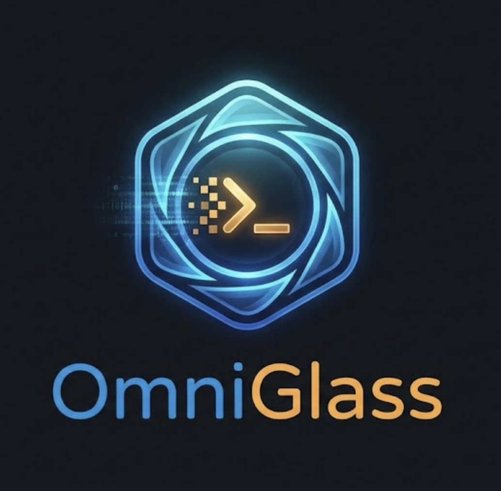

<p align="center">
  
</p>

<h1 align="center">OmniGlass: The Visual Action Engine</h1>

<p align="center">
  <strong>Snip your screen. AI does the rest.</strong><br/>
  Not another screenshot tool. Not another chatbot. A secure execution engine.<br/>
  You snip a Python error — it runs the fix. You snip a table — it exports the CSV.<br/>
  Open source. Runs locally. You build the plugins.
</p>

<p align="center">
  <a href="#the-execution-gap">Demo</a> •
  <a href="#build-a-plugin-in-5-minutes">Build a Plugin</a> •
  <a href="#quick-start">Install</a> •
  <a href="https://discord.gg/omniglass">Discord</a> •
  <a href="docs/plugin-guide.md">Plugin Guide</a>
</p>

<p align="center">
  
  
  
  
</p>

<p align="center">
  
</p>

---

## The Execution Gap

Every AI tool on your desktop does the same thing: you show it your screen, and it **talks at you**. OmniGlass reads your screen, understands the context, and gives you buttons that execute.

| You snip... | Claude Desktop tells you... | OmniGlass does... |
|---|---|---|
| A Python error | "Try running `pip install pandas`" | Generates `pip install pandas`, you click **Run**. Done. |
| A data table | Gives you a messy markdown blob | Opens a native save dialog — **CSV ready** |
| A Slack bug report | Writes a draft to copy-paste | **Creates the GitHub issue** with context filled in |
| Japanese documentation | Explains the translation | **English on your clipboard** |
| Nothing — you type instead | — | "How much disk space?" → runs `df -h` → **shows the answer** |

## How It Works

You snip your screen → native OCR extracts text on-device (Apple Vision on macOS, Windows OCR on Windows — no images leave your machine) → text goes to an LLM (Claude, Gemini, or Qwen-2.5 running locally) → the LLM classifies the content and returns a menu of actions in under 1 second → you click an action → it executes through the built-in handler or a sandboxed MCP plugin.

Two inputs (snip or type), one pipeline, same plugin system.

| Provider | Type | Speed |
|---|---|---|
| Claude Haiku | Cloud | ~3s |
| Gemini Flash | Cloud | ~3s |
| **Qwen-2.5-3B** | **Local (llama.cpp)** | **~6s, fully offline** |

No OmniGlass servers. Your key talks directly to the provider. We never see your data.

## Build a Plugin in 5 Minutes

OmniGlass is a platform built on the [Model Context Protocol (MCP)](https://modelcontextprotocol.io/). The built-in actions are just the starting point.

Here's what makes plugin development different from anything else you've built: **you don't write prompt engineering.** OmniGlass handles the Screen → OCR → LLM pipeline. By the time your plugin code runs, you're receiving clean, structured JSON. You write the API call. That's it.

A complete plugin that sends whatever you snip to a Slack channel:

```javascript
// index.js — that's the whole plugin
import { Server } from "@modelcontextprotocol/sdk/server/index.js";
import { StdioServerTransport } from "@modelcontextprotocol/sdk/server/stdio.js";

const server = new Server({ name: "slack-post", version: "1.0.0" }, {
  capabilities: { tools: {} }
});

server.setRequestHandler("tools/list", async () => ({
  tools: [{
    name: "post_to_slack",
    description: "Send captured screen content to a Slack channel",
    inputSchema: {
      type: "object",
      properties: {
        message: { type: "string", description: "The content to post" },
        channel: { type: "string", description: "Slack channel name" }
      },
      required: ["message"]
    }
  }]
}));

server.setRequestHandler("tools/call", async (request) => {
  const { message, channel } = request.params.arguments;
  await fetch(process.env.SLACK_WEBHOOK_URL, {
    method: "POST",
    headers: { "Content-Type": "application/json" },
    body: JSON.stringify({ channel: channel || "#general", text: message })
  });
  return { content: [{ type: "text", text: `Posted to ${channel || "#general"}` }] };
});

const transport = new StdioServerTransport();
await server.connect(transport);
```

```json
// omni-glass.plugin.json — the manifest
{
  "name": "Slack Post",
  "command": "node",
  "args": ["index.js"],
  "env_keys": ["SLACK_WEBHOOK_URL"],
  "permissions": { "network": ["hooks.slack.com"] }
}
```

Drop it in `~/.config/omni-glass/plugins/slack-post/`. Restart. Your action appears in the menu.

**What the community could build** (each under 100 lines):

- Snip a bug → create a **Jira / Linear / Asana** ticket
- Snip a mockup → generate **Tailwind CSS**
- Snip a SQL error → query your schema, **suggest and run the fix**
- Snip a receipt → extract the total, **log to your expense tracker**
- Snip an API response → generate **TypeScript types**
- Snip a whiteboard sketch → convert to a **Mermaid diagram**
- Snip a meeting invite → check **Google Calendar** for conflicts
- Snip anything → save to **Obsidian / Notion / Logseq**

The best plugin ideas will come from you. [Open a discussion](https://github.com/goshtasb/OmniGlass/discussions) or just build it and open a PR.

→ **[Full Plugin Developer Guide](docs/plugin-guide.md)**

## The Security Moat

Claude Desktop runs MCP plugins with your full user permissions. A rogue plugin — or a prompt injection — has access to your SSH keys, `.env` files, and browser cookies.

OmniGlass is a **Zero-Trust Execution Engine**.

| Layer | What it does |
|---|---|
| **Kernel-level sandbox** | Every plugin runs in macOS `sandbox-exec`. Your `/Users/` is walled off. A plugin **physically cannot** read your home folder unless you approved a specific path. |
| **Environment filtering** | `ANTHROPIC_API_KEY`, `AWS_SECRET_ACCESS_KEY`, and other secrets are invisible to plugin processes. |
| **Command confirmation** | Every shell command shows in the UI. You click **Run** or **Cancel**. |
| **PII redaction** | Credit card numbers, SSNs, and API keys are scrubbed before text goes to a cloud LLM. |
| **Permission prompt** | First install shows exactly what the plugin can access. You approve or deny. |

## Quick Start

> **No API key?** OmniGlass runs Qwen-2.5-3B locally via llama.cpp. Full pipeline in ~6 seconds, entirely offline.

**macOS** (primary platform — requires macOS 12+, Rust, Node.js 18+):

```bash
git clone https://github.com/goshtasb/omniglass.git
cd omniglass
npm install
npm run tauri dev
```

1. Click the OmniGlass icon in your menu bar
2. **Settings** → paste your Anthropic or Google API key, or select **Local** and download the Qwen model
3. **Snip Screen** → draw a box → see the action menu → click an action

Pre-built `.dmg` installer coming soon.

**Windows** — compiles and passes CI. Needs real-hardware testing. If you have a Windows machine, see [Issue #1](https://github.com/goshtasb/OmniGlass/issues/1).

**Linux** — planned. Needs Tesseract OCR, Bubblewrap sandbox, Wayland tray support. This is a meaningful contribution if you want to own it. See [Issue #2](https://github.com/goshtasb/OmniGlass/issues/2).

## Contributing: The Sandbox Challenge

**We challenge you to break the sandbox.**

Every plugin runs inside a kernel-level `sandbox-exec` profile. If you can read `~/.ssh/id_rsa` from a plugin process, that is a **critical security bug**. Open an issue immediately.

Beyond the sandbox:

- **🔌 Build a plugin.** Pick any API you use daily, make it an OmniGlass action. The [Plugin Developer Guide](docs/plugin-guide.md) gets you from zero to working plugin in 5 minutes.
- **🪟 Own the Windows port.** It compiles. It needs a champion. ([Issue #1](https://github.com/goshtasb/OmniGlass/issues/1))
- **🐧 Own the Linux port.** Tesseract + Bubblewrap + Wayland. ([Issue #2](https://github.com/goshtasb/OmniGlass/issues/2))
- **💬 Tell us what to build.** The [Discussions tab](https://github.com/goshtasb/OmniGlass/discussions) drives the roadmap. The features that get the most demand get built first.

## Community


→ **[Discussions](https://github.com/goshtasb/OmniGlass/discussions)** — feature requests, roadmap input

→ **[Plugin Developer Guide](docs/plugin-guide.md)** — start building

## License

MIT
